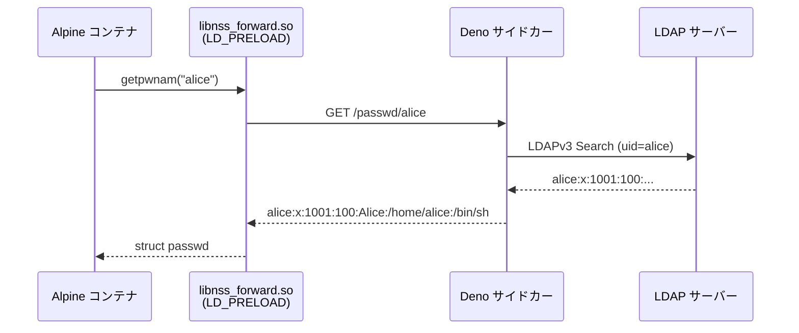

# nss-forward

Alpine Linux (musl libc) コンテナで LDAP ユーザー/グループ情報を解決するための 2 コンポーネント構成のライブラリです。

musl には glibc 向け NSS モジュール (`nss_ldap` 等) が動作しないため、`LD_PRELOAD` による関数オーバーライドと Deno サイドカーコンテナを組み合わせて解決します。

## アーキテクチャ



## コンポーネント

| コンポーネント | 説明 |
|---|---|
| `libnss_forward.so` | `getpwnam` / `getpwuid` / `getgrnam` / `getgrgid` (および `_r` 変種) を LD_PRELOAD でオーバーライドする musl 向け C ライブラリ |
| Deno サイドカー | LDAPv3 に接続し、passwd/group フォーマットで返す HTTP サーバー |

## 使い方

### .so の取得

```sh
# curl パターン
curl -Lo /lib/libnss_forward.so \
  https://github.com/YOUR_ORG/nss-forward/releases/latest/download/libnss_forward.so
```

```dockerfile
# OCI パターン
COPY --from=ghcr.io/YOUR_ORG/nss-forward:latest /libnss_forward.so /lib/
```

### Docker Compose への組み込み

```yaml
services:
  nss-proxy:
    image: ghcr.io/YOUR_ORG/nss-forward-server:latest
    environment:
      LDAP_URL: ldap://ldap:389
      LDAP_BIND_DN: cn=admin,dc=example,dc=com
      LDAP_BIND_PW: secret
      LDAP_USER_BASE: ou=users,dc=example,dc=com
      LDAP_GROUP_BASE: ou=groups,dc=example,dc=com

  app:
    image: alpine:3.19
    environment:
      LD_PRELOAD: /lib/libnss_forward.so
      NSS_PROXY_URL: http://nss-proxy:8080
```

## 設定

### libnss_forward.so

| 環境変数 | デフォルト | 説明 |
|---|---|---|
| `NSS_PROXY_URL` | `http://nss-proxy:8080` | Deno サーバーのベース URL |

### Deno サーバー

| 環境変数 | デフォルト | 説明 |
|---|---|---|
| `LDAP_URL` | `ldap://localhost:389` | LDAP サーバー URL |
| `LDAP_BIND_DN` | (必須) | Bind DN |
| `LDAP_BIND_PW` | (必須) | Bind パスワード |
| `LDAP_USER_BASE` | (必須) | ユーザー検索ベース DN |
| `LDAP_GROUP_BASE` | (必須) | グループ検索ベース DN |
| `PORT` | `8080` | HTTP リッスンポート |

`uidNumber` 属性がない場合、`sambaSID` の RID から `10000 + RID` を uid として導出します。

## ビルド・テスト

```sh
# .so のビルド
make build

# C テスト (libnss_forward.so)
make test

# Deno テスト (server/)
deno test --allow-net --allow-env test/*.ts
```

## HTTP API

詳細は [PROTOCOL.md](PROTOCOL.md) を参照してください。

| エンドポイント | 説明 |
|---|---|
| `GET /passwd/{name}` | ユーザー名で検索 |
| `GET /passwd/uid/{uid}` | UID で検索 |
| `GET /group/{name}` | グループ名で検索 |
| `GET /group/gid/{gid}` | GID で検索 |

レスポンスは `/etc/passwd` / `/etc/group` と同一フォーマットのプレーンテキストです。
